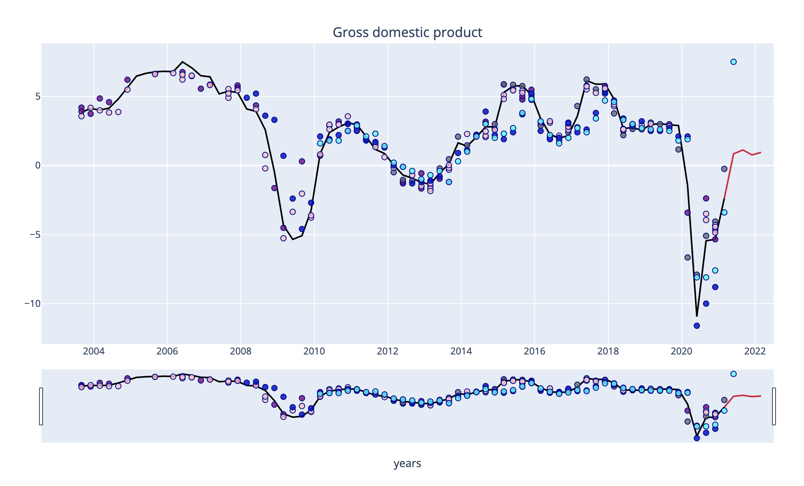

# *Forecasting the Czech economy*
---

**Welcome to my repository for the crypto portfolio. Please explore the codebase!**  

---
## Analytical Summary

This project forecasts the Czech macroeconomic variables. The results are deployed on my blog https://ggforecast.wpcomstaging.com.

The applied method consists of the Random forest and XGBoost models. The models are trained on variables for the entire Eurozone. The estimation process utilizes quarterly data which are being automatically scraped from the Eurostat and the Czech Statistical Office.

For further insight on the methodology, see my article on Random forest (citation below). The herein presented forecast is estimated on a different, richer dataset in comparison to the article. Instead of scraping data only for the Czech economy, the current models train also on data from the remaining Eurozone states. This discrepancy results in a dataset with thousands of rows.

## Usage

To use this project simply clone the repository and run the code **Scraping_Notebook2.ipynb** in JupyterLab or in VS Code.

---

## Citation
•	GAWTHORPE, Kateřina. Random forest as a model for Czech forecasting. Prague economic papers [online]. 2021. 22 s. eISSN 2336-730X. ISSN 1210-0455. DOI: 10.18267/j.pep.765. Available in: https://pep.vse.cz/getrevsrc.php?identification=public&mag=pep&raid=923&type=fin&ver=2.

---

